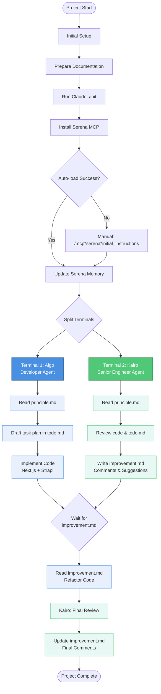

# 🧠 Claude Code – Context Engineering Guide

## 🎯 Objective

This guide outlines the setup of Claude Code with Serena MCP and defines the collaboration process between developer and senior engineer agents using structured project files.

## 🏗️ System Components

| Component              | Function              | Interactions                         |
| ---------------------- | --------------------- | ------------------------------------ |
| **Claude Code CLI**    | Main interface        | Controls terminals, connects to MCP  |
| **Serena MCP Server**  | Context management    | Stores memory, provides instructions |
| **Terminal 1 (Algo)**  | Developer agent       | Next.js/Strapi implementation        |
| **Terminal 2 (Kairo)** | Senior engineer agent | Code review and architecture         |

## 📊 Agent Workflow Overview



## ✅ Initial Setup

### 1. **Prepare Documentation**

- Ensure `PRD.md` is complete and accurate
- Clean and update `README.md`

### 2. **Run Claude**

```bash
/init
```

### 3. **Install Serena MCP**

Add Serena using:

```bash
claude mcp add serena -- <serena-mcp-server> --context ide-assistant --project $(pwd)
```

Example using `uvx`:

```bash
claude mcp add serena -- uvx --from git+https://github.com/oraios/serena serena start-mcp-server --context ide-assistant --project $(pwd)
```

### 4. **Load Serena Instructions (if required)**

If Claude fails to auto-load them:

```bash
/mcp*serena*initial_instructions
```

Ensure `initial_instructions` is enabled under `included_optional_tools` in the config.

### 5. **Update Serena's Memory**

After setup, prompt Claude:

> _"Serena, please update your memory with the current project context."_

## 🧪 AI Agent Terminals (2 Required)

### 👨‍💻 Terminal 1 – **Algo** (Developer Agent)

**Tech Stack:** Next.js + Strapi

**Principles:**

- Must follow the **DRY (Don't Repeat Yourself)** principle
- **🚫 Read-only access to** `improvement.md`

**Tasks:**

1. Read `principle.md`
2. Draft a task plan in `todo.md`
3. Begin implementation based on the plan
4. After `improvement.md` is updated by Kairo, refactor accordingly

### 🧠 Terminal 2 – **Kairo** (Senior Principal Engineer Agent)

**Role:** Reviews and improves architecture and code quality

**Tasks:**

1. Read `principle.md`
2. Review code and `todo.md`
3. Write and update `improvement.md` with comments and suggestions
4. Perform a final review after Algo's refactor

## 💡 Best Practices

1. **Communication:** All inter-agent communication happens through files
2. **Iteration:** Multiple review cycles may be needed for complex features
3. **Documentation:** Keep `todo.md` updated with progress
4. **Code Quality:** Algo must strictly adhere to DRY principles
5. **Review Depth:** Kairo should provide actionable, specific feedback

## 🚀 Quick Start Commands

```bash
# Initialize Claude
/init

# Install Serena MCP
claude mcp add serena -- uvx --from git+https://github.com/oraios/serena serena start-mcp-server --context ide-assistant --project $(pwd)

# Load instructions if needed
/mcp*serena*initial_instructions

# Update memory
"Serena, please update your memory with the current project context."
```

---

_This guide ensures consistent, high-quality development through structured AI agent collaboration._
